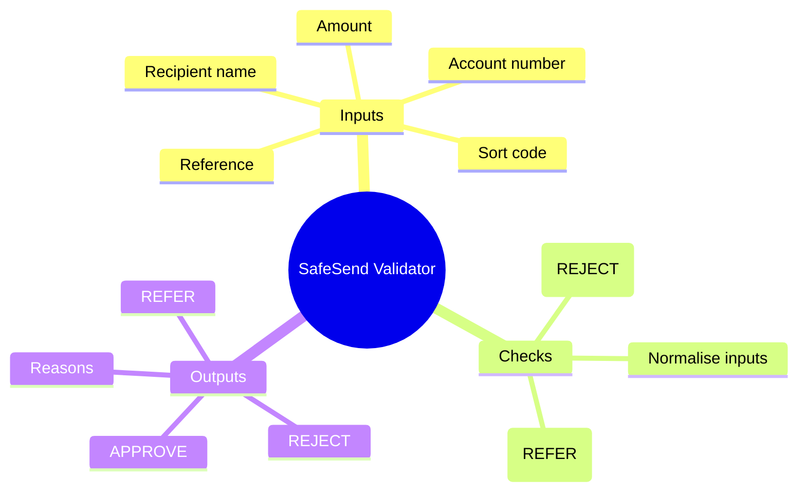
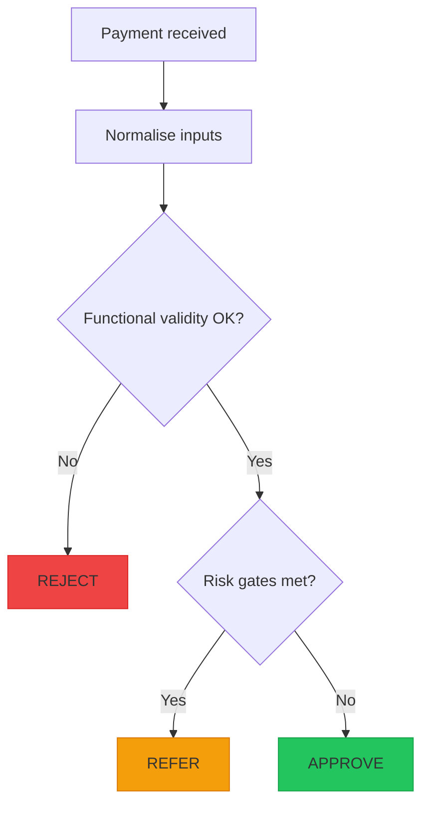

# Phase 0: Setup, Roles, and Visual Thinking (5-10 mins)

## Goal of Phase 0
By the end of this phase you should be able to:
- Explain what SafeSend will output (`APPROVE`, `REJECT`, `REFER`)
- Identify what inputs you must validate and where risk-based rules apply
- Produce a simple visual of the decision logic (process flow and/or mind-map)
- Agree (in plain English) what you will implement next in Phase 1/2

This exercise is assessed on **thinking + testing + reasoning**, not typing speed.

## Timebox
- 0:00-1:00 Orientation (what the feature does, outcomes, grading focus)
- 1:00-4:00 Setup in VS Code (folder, files, Python vs pseudocode)
- 4:00-8:00 Roles + “visual warm-up” (mind-map and process flow)
- 8:00-10:00 Gap checklist (what you know vs what you must assume)

## Step-by-step guidance

### 1) Orientation: what are we building? (0:00-1:00)
1. Read the scenario once out loud (yes, really).
2. Say the outcomes in your own words:
   - `REJECT`: the payment is **invalid** (for example, wrong length digits, out of allowed amount limits)
   - `REFER`: the payment is **valid format**, but has **risk signals** that need review
   - `APPROVE`: valid and low risk
3. Rule priority mindset (important for later tests):
   - If something is **invalid**, it should become `REJECT` (even if there might also be a risk keyword).
   - Only consider `REFER` after the payment passes basic functional validity checks.

### 2) Setup: create the working files (1:00-4:00)
1. Create a new folder for the exercise (example name: `safesend_qe_exercise`).
2. Open that folder in VS Code.
3. Create these files:
   - `validator.py`
   - `test_validator.py`
4. Decide how you will proceed:
   - Write the validator and run tests using Python.

Begin with the smallest plan that you can test quickly.

### 3) Pair programming: driver + navigator (4:00-5:30)
This exercise is designed to be done in pairs. If you are solo, simulate a pair by switching roles frequently.

1. **Driver** (typing):
   - Writes the code and tests while talking through each step
   - Keeps the team moving forward
2. **Navigator** (reviewing):
   - Watches for edge cases, asks “what if…?”, and suggests test ideas
   - Checks that the work matches the requirements and risk rules

Swap roles often (e.g., every 10–15 minutes or after each small task) so both people stay engaged in design and implementation.
### 4) Visual warm-up: draw it before you code (5:30-8:30)
Use either paper/pen, a whiteboard, or a Mermaid preview in markdown.

#### 4A) Mind-map (what you think about)
Draw a mind-map starting from “SafeSend Validator” and branch into:
- Inputs (amount, sort code, account number, recipient name, optional reference)
- Checks
  - Normalisation (for example: strip spaces/hyphens from sort code)
  - Functional validity (rules that cause `REJECT`)
  - Risk gates (rules that cause `REFER`)
- Outputs
  - `APPROVE`, `REJECT`, `REFER`
  - reasons (what you will explain)

Mermaid mind-map template (use as a starting point):

#### 4B) Process flow (how the decision happens)
Now draw a simple flow for check order:
1. Normalise inputs
2. Functional validity checks
3. Risk gate checks
4. Output decision + reasons

Mermaid process flow template (with coloured decision outcomes):

### 5) Gap checklist: what do we know vs what do we decide? (8:30-10:00)
Do not skip this. It prevents “surprises” later when writing tests.
1. For each input field, write down:
   - What format is explicitly specified?
   - What might appear in real life (extra spaces, hyphens, empty reference)?
2. For each rule ID (you will list them in Phase 1), answer:
   - What outcome will it produce? (`REJECT` or `REFER`)
   - What reason text/code will we return?
3. Add 1-3 assumptions only (example):
   - “We will strip spaces/hyphens from sort code before checking it has 6 digits.”
4. If a requirement feels ambiguous, ask yourself:
   - “What would a user/customer see if this rule fails?”

## End-of-Phase 0 checklist (tick these off)
- [ ] I can explain `APPROVE` vs `REJECT` vs `REFER`
- [ ] I drew a mind-map or process flow (or both)
- [ ] I wrote down assumptions (if any)
- [ ] I know the next step: designing tests that prove each rule

## AI usage starter prompts (copy/paste)
- “Help me translate these rules into a clear decision order. What should be checked first and why?”
- “Suggest edge cases for amount, sort code, account number, and reference keywords. Keep it UK-focused.”
- “Propose reason codes that are short and stable for automated tests.”
- “Review my check order and tell me if any rule priority might cause wrong outcomes.”

