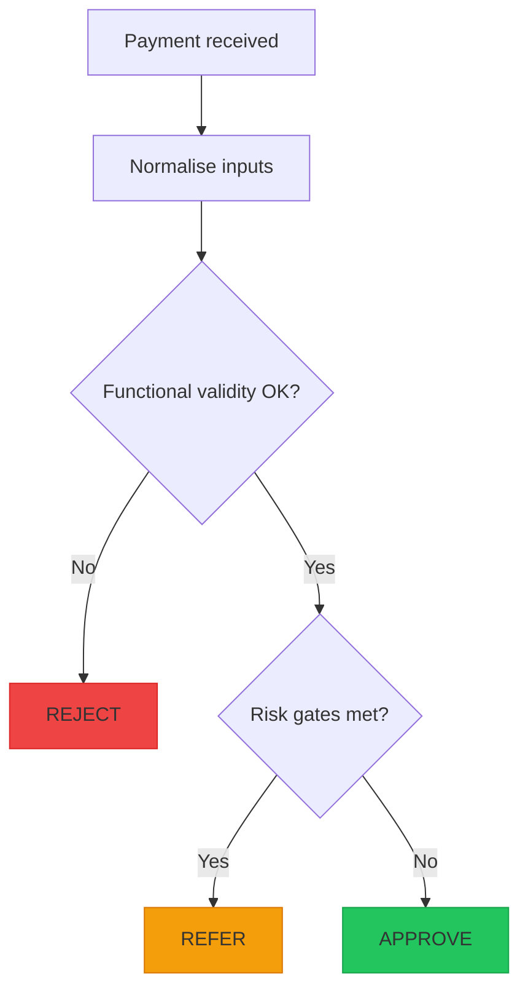
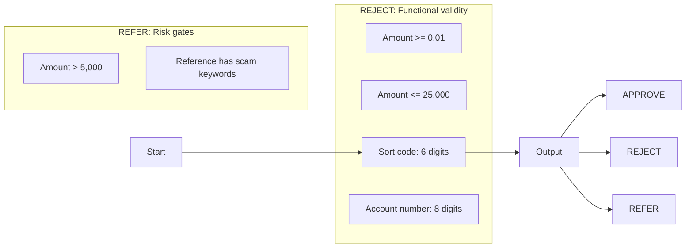

# Phase 1: Understand Requirements & Risks (35-45 mins)

## Goal of Phase 1
By the end of this phase you should be able to:
- Rewrite the SafeSend rules in your own words
- Classify rules into `REJECT` (invalid) vs `REFER` (valid format but risky)
- Record any assumptions you had to make (and why)
- Define what you will return when rules fail (reason text/code)
- Visualise the decision logic in a simple diagram
- Produce a “Requirements List” that you can use directly for test design in Phase 2

This is about **thinking and risk reasoning**. Don’t jump to coding yet.

## Timebox
- 0:00-0:10 Read once, understand outcomes
- 0:10-0:25 Rewrite and classify rules + assumptions
- 0:25-0:35 Gap analysis + reason codes/outcome decisions
- 0:35-0:45 Visualise + create your requirements list

## Step-by-step guidance

### 1) Start with the outcome meaning (0:00-0:10)
Write the three outputs as plain English:
- `REJECT`: the payment is **invalid** (format/limits fail)
- `REFER`: the payment is **valid format**, but triggers a risk gate
- `APPROVE`: valid and low risk

Decision priority to keep in mind (this will affect tests):
- Any **invalid** input becomes `REJECT`, even if it also contains suspicious risk keywords.
- Only evaluate risk gates (`REFER`) if the payment passes functional validity checks.

### 2) Rewrite the rules in your own words (0:10-0:15)
Copy the rule list, but rephrase it so you can explain it to someone else.

Functional validity (causes `REJECT`):
- Amount must be at least `0.01`
- Amount must be no more than `25,000`
- Sort code must be exactly 6 digits (ignore spaces/hyphens)
- Account number must be exactly 8 digits

Risk / quality gates (cause `REFER`):
- If amount is **over** `5,000` then `REFER`
- If reference contains suspicious terms (e.g., `crypto`, `investment`, `urgent`) then `REFER`

Important boundary interpretation (record this as an assumption if unsure):
- “Over £5,000” means `£5,000.00` should **not** trigger the risk gate, but `£5,000.01` should.

### 3) Classify rules and note what must be normalised (0:15-0:20)
Make two lists:
- Functional validity rules -> `REJECT`
- Risk gate rules -> `REFER`

Also write down any normalisation you will do before validation. Example from the scenario:
- Sort code may include spaces or hyphens, but you will strip them before checking digit count.

If you are unsure about other “real life” variations, decide and record them now (do not leave them as an open question).
Examples to consider:
- Is the suspicious keyword match case-insensitive (e.g., `Urgent` vs `urgent`)?
- Is reference allowed to be blank/empty, and if so does it trigger the keyword risk?

### 4) Gap analysis (the “what do we still have to decide?” checklist) (0:20-0:30)
Before designing tests, answer these questions:

1. What is explicitly specified?
- What exact formats and limits are stated?
- What exact keyword examples are given?

2. What must we infer or assume?
- Keyword case sensitivity
- Whether reference can be empty
- How amount is represented (number vs string, decimal precision) if you later implement in code

3. For each rule, what should the user see when it fails?
- Decide what “reason” you will return for each failure.
- Prefer stable reason codes (short identifiers) so your tests can assert reliably.

For the starter set, a good reason-code approach might be:
- `invalid_amount_low`
- `invalid_amount_high`
- `invalid_sort_code`
- `invalid_account_number`
- `refer_high_value`
- `refer_scam_keywords`

Write your chosen mapping now: Rule ID -> Reason code -> Outcome.

### 5) Visualise the decision logic (0:30-0:40)
Draw (by hand or Mermaid) how a payment moves through checks.

#### 5A) Process flow (recommended)

#### 5B) Rule-to-outcome mapping (simple “mind of the system”)

### 6) Create your “Requirements List” table (0:40-0:45)
Create a small table with one row per rule:
- `ID`
- `Rule`
- `Pass example`
- `Fail example`
- `Outcome` (`APPROVE` / `REJECT` / `REFER`)
- `Reason code` (what your tests will assert)

You are not writing full test cases yet; you are defining the expected behaviour you will later turn into tests.

## Optional: use AI, but keep control (always your decisions)
Good AI prompts for this phase:
- “Help me rewrite these rules in simpler words for apprentices.”
- “Which parts are ambiguous? Propose reasonable assumptions and explain trade-offs.”
- “Suggest stable reason codes for each failure so tests can be deterministic.”
- “Review my decision order: should REJECT happen before REFER? If not, why?”

## End-of-Phase 1 checklist
- [ ] I can explain the difference between `REJECT` and `REFER`
- [ ] I wrote my assumptions (not hidden in my head)
- [ ] I classified each rule into REJECT vs REFER
- [ ] I defined reason codes for each rule that can fail
- [ ] I drew a process flow diagram of check order
- [ ] I produced a requirements list table I can convert into tests in Phase 2

