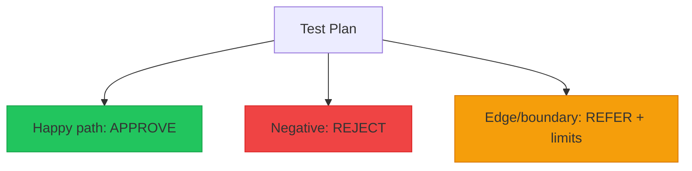
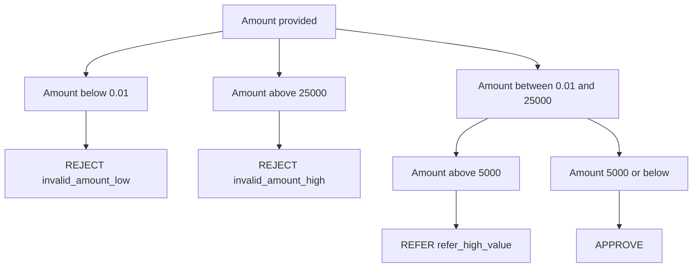
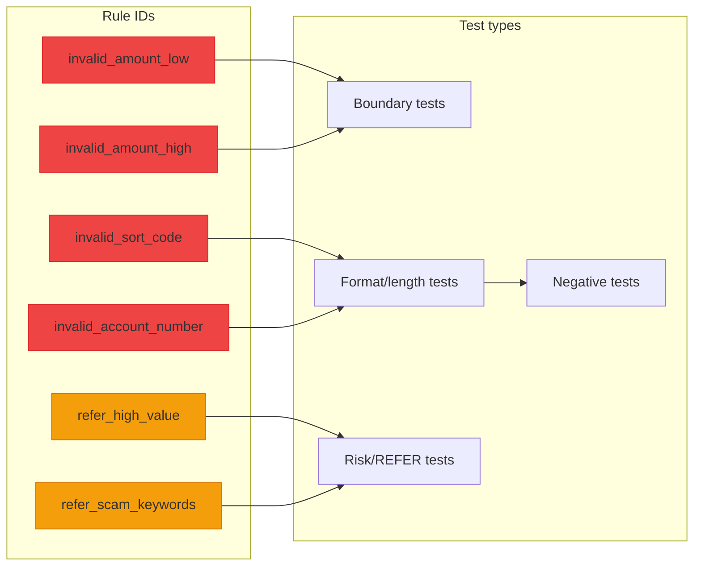
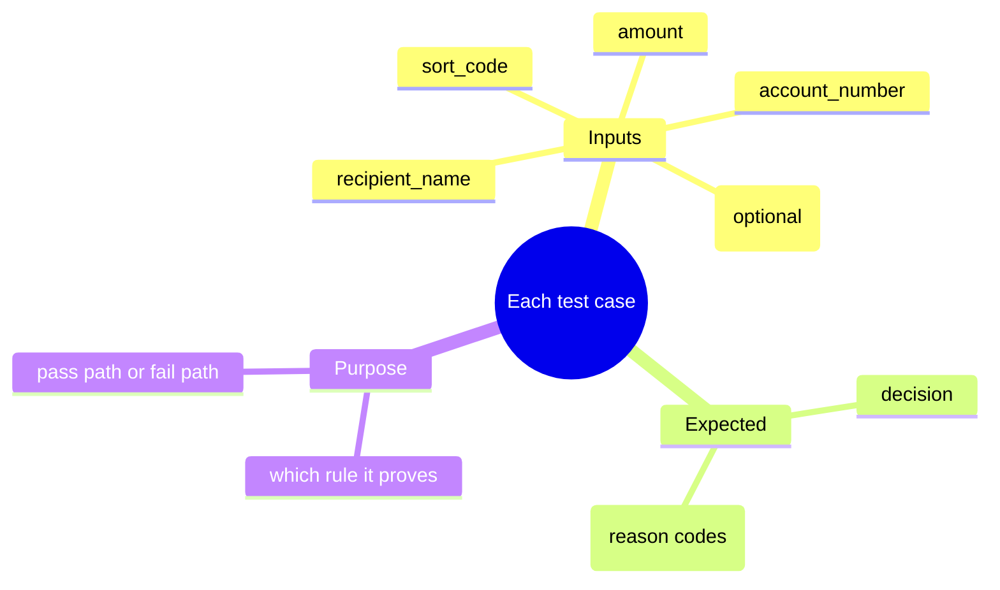

# Phase 2: Test Design (Test Plan + Test Cases) (25-35 mins)

## Goal of Phase 2
By the end of this phase you should have:
- A clear **Test Plan** (happy path, negative tests, boundary/edge tests)
- A set of **test cases** with precise expected outputs
- A **traceability / coverage check** linking each rule to the tests that prove it
- Confidence that your tests will catch common bugs (and not just the “obvious” ones)

This phase is about **designing proof**. Coding comes later (Phase 3+).

## BDD Connection
Building on the BDD approach from Phase 1, this phase translates the refined requirements and acceptance criteria into concrete test cases. Each test case represents a specific behavior that must be proven to work correctly.

## Timebox
- 0:00-0:10 Solution design checkpoint (define outputs + reason codes)
- 0:10-0:25 Build the Test Plan and choose test cases
- 0:25-0:35 Add boundary/format/risk tests + expected outcomes
- 0:25-0:35 Do traceability / gap analysis and finalise the list of tests

## Step-by-step guidance

### 1) Solution design checkpoint (before you write tests) (0:00-0:10)
Answer these in writing first:
1. What is the validator “shape”?
   - What goes in (inputs/fields)?
   - What comes out (`decision` + `reasons`)?
2. What will you assert in tests?
   - Prefer checking **reason codes** (stable identifiers) rather than matching full free-text.
3. What check order will your design follow?
   - Recommended: functional validity checks first (`REJECT`), then risk gates (`REFER`).
4. Which reason codes will you use?
   - Example starter list:
     - `invalid_amount_low`
     - `invalid_amount_high`
     - `invalid_sort_code`
     - `invalid_account_number`
     - `refer_high_value`
     - `refer_scam_keywords`

If you don’t know the reason codes yet, stop and decide now—your tests need something deterministic.

### 2) Create the Test Plan (0:10-0:15)
Create three sections and fill them in:
- A) **Happy path**: payments that should end up as `APPROVE`
- B) **Negative tests**: inputs that should end as `REJECT`
- C) **Edge/boundary tests**: values at limits, plus `REFER` triggers

Simple rule of thumb:
- If a test fails, you should be able to explain *which rule* it proves.

### 3) Choose boundary tests for `amount` (0:15-0:20)
Add these amount boundary tests (these are high value because they catch off-by-one/rounding mistakes):
- `£0.00` -> `REJECT` (reason: amount too low)
- `£0.01` -> `APPROVE`
- `£25,000` -> `APPROVE`
- `£25,000.01` -> `REJECT` (reason: amount too high)

Decision logic reminder:
- Even if other risk keywords exist, `REJECT` should win when functional validity fails.

### 4) Add format tests for `sort_code` and `account_number` (0:20-0:25)
Sort code (6 digits after normalisation):
- `12-34-56` should be treated as `123456`
- `12 34 56` should also be treated as `123456` (if you decide to support spaces)
- Sort code with letters -> `REJECT`
- Wrong number of digits -> `REJECT`

Account number:
- 7 digits -> `REJECT`
- 8 digits -> can pass if amount + sort code are valid
- 9 digits -> `REJECT`

If you haven’t agreed on normalisation rules (spaces/hyphens allowed or not), decide this during Phase 1 and keep it consistent.

### 5) Add risk tests for `REFER` (0:25-0:30)
You need at least two tests that lead to `REFER`:
- High value threshold:
  - `£5,000.00` -> `APPROVE`
  - `£5,000.01` -> `REFER` (reason: `refer_high_value`)
- Suspicious keywords in reference:
  - reference contains `urgent` -> `REFER` (reason: `refer_scam_keywords`)

Also decide (and then keep consistent) whether keyword matching is:
- case-insensitive (`Urgent` should trigger the same as `urgent`)
- substring-based or whole-word based (scenario suggests keyword contains terms; simplest is substring)

### 6) Define expected outputs precisely (0:30-0:35)
For each test case, specify:
- `decision`: `APPROVE` / `REJECT` / `REFER`
- `reasons`: list of reason codes you expect

Example expectations style (illustrative):
- If it’s `REJECT`, you should expect the relevant `invalid_*` reason code(s).
- If it’s `REFER`, you should expect `refer_high_value` and/or `refer_scam_keywords`.

In other words: your expected outcome should be something you can assert in code later.

### 7) Traceability / gap analysis (0:25-0:35)
Make a simple checklist that answers, for each starter rule ID:
- Is there at least one test that proves it can PASS? (Yes/No)
- Is there at least one test that proves it can FAIL? (Yes/No)

If anything is missing, add one targeted test now (rather than hoping your implementation covers it).

Optional: add a quick test matrix or checklist:
- rule ID
- test name/id
- input sketch
- expected decision
- expected reason codes

## Helpful visualisations (optional)

### A) Test plan structure diagram

### B) Boundary / off-by-one thinking (amount)

This diagram helps you “see” why you need both `£5,000.00` and `£5,000.01`.

### C) Rule-to-test traceability map

Use this as a sanity check: every rule should have both a “can pass” and “can fail” path proven by at least one test.

### D) Test case blueprint (what each test must contain)

This keeps your test cases consistent so they’re easy to run later.

## End-of-Phase 2 checklist
- [ ] I have a Test Plan with A) happy path B) negative tests C) edge/boundary tests
- [ ] I have boundary tests for `£0.01`, `£25,000`, and the “just below/above” cases
- [ ] I have format tests for sort code and account number lengths
- [ ] I have at least 2 `REFER` tests (high value + keyword risk)
- [ ] Every test has precise expected `decision` and reason codes
- [ ] I completed traceability / gap analysis and fixed any missing rule coverage

## AI prompts (copy/paste)
- “Turn my requirements list into a compact set of ~12 test cases with expected decision and reason codes.”
- “Suggest additional edge cases for sort code and amount representation (keep them UK-focused).”
- “Review whether my test suite might miss an off-by-one or prioritisation bug (REJECT vs REFER).”

