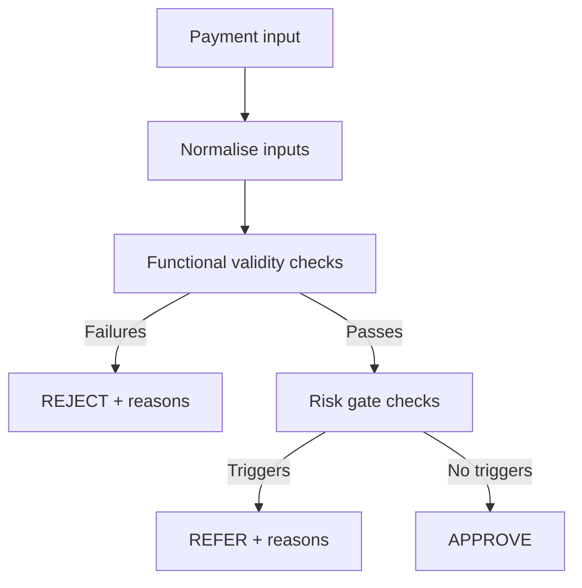
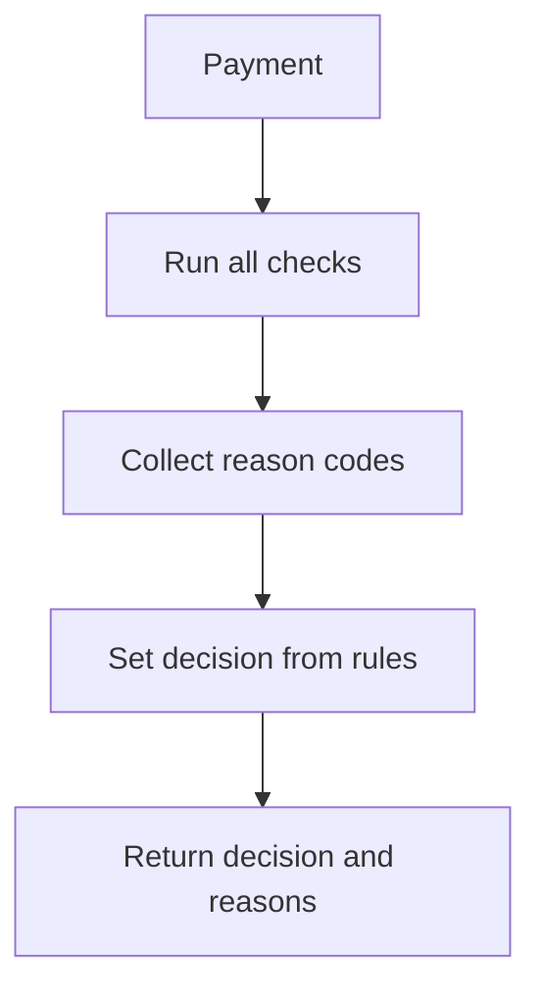

# Phase 3: Implement the Validator (Small Steps) (60-75 mins)

## Goal of Phase 3
By the end of this phase you should have:
- A working validator function/script that returns a `decision` and a list of `reasons`
- Implemented checks in the right order (normalise -> functional validity -> risk gates)
- Evidence you can explain: what each check does and how it maps to your tests
- Confidence you didn’t “accidentally” stop after the first error (you should return **all** reasons)

This phase is about **building the thing you designed in Phases 1 and 2**.

## Timebox (suggested)
- 0:00-0:15 Turn your design into an implementation plan
- 0:15-0:40 Implement in small steps + run manual checks
- 0:40-1:05 Wire up/confirm reason codes + update micro gaps with tests
- 1:05-1:15 Prepare for Phase 4 (automated test run)

## Step-by-step guidance

### 1) Start from your design, not from random code (0:00-0:15)
Before you touch “real” logic:
1. Re-check your chosen function contract:
   - Example: `validate_payment(payment) -> (decision, reasons)`
2. Confirm your output shape:
   - `decision`: `APPROVE` / `REJECT` / `REFER`
   - `reasons`: a list of reason codes (stable strings)
3. Confirm your check order:
   - Normalise inputs first
   - Functional validity checks next (these can produce `REJECT`)
   - Risk gates last (these can produce `REFER`)

Why this matters:
- In bank-style logic, `REJECT` should take priority over `REFER` when validity fails.

4. Make your output deterministic (so tests don’t flake)
   - Decide a consistent ordering for `reasons`.
   - A simple rule: append **functional validity reasons first**, then **risk gate reasons**.
   - Keep reason codes stable (never depend on long free-text messages for tests).

5. Write a short “rule to behaviour” mapping (one line per rule)
   - For each rule ID in your Phase 1/2 requirements list, write:
     - what it is checking
     - which reason code it adds
     - which decision it can influence (`REJECT` or `REFER`)

6. Create a tiny implementation plan you can tick off
   - Tick items in the order you will code them:
     - [ ] Normalise inputs (sort code formatting)
     - [ ] Run functional validity checks and populate `reasons`
     - [ ] If any functional reasons exist, set `decision = REJECT`
     - [ ] Otherwise, run risk gates and populate additional reasons
     - [ ] If any risk reasons exist, set `decision = REFER`
     - [ ] If `reasons` is empty, set `decision = APPROVE`

Template you can copy into your notes (fill in the blanks)

```text
Function contract:
  Input fields: amount, sort_code, account_number, recipient_name, reference
  Output:
    decision = APPROVE | REJECT | REFER
    reasons = [reason_code_1, reason_code_2, ...]  (ordered: functional first, then risk)

Decision precedence:
  REJECT wins over REFER when functional validity fails

Check order:
  1) Normalise sort_code
  2) Functional validity checks -> may add invalid_* reasons
  3) If any invalid_* reasons: decision REJECT (skip risk gates)
  4) Else risk gates -> may add refer_* reasons -> decision REFER

Rule mapping:
  invalid_amount_low      -> adds invalid_amount_low  -> decision REJECT
  invalid_amount_high     -> adds invalid_amount_high -> decision REJECT
  invalid_sort_code       -> adds invalid_sort_code  -> decision REJECT
  invalid_account_number  -> adds invalid_account_number -> decision REJECT
  refer_high_value        -> adds refer_high_value  -> decision REFER
  refer_scam_keywords     -> adds refer_scam_keywords -> decision REFER
```

7. Use AI to sanity-check, not to replace your thinking
   - Ask AI: “Is my decision precedence and reason-code ordering testable?”
   - Ask AI: “Any missing checks or ambiguous assumptions that would break my reason codes?”

### 2) Represent a payment cleanly (0:15-0:20)
Use a simple structure so tests are easy to write later:
- Represent a payment as a dictionary/object with keys:
  - `amount`
  - `sort_code`
  - `account_number`
  - `recipient_name`
  - `reference`

Even if you can code without it, using a consistent structure helps reduce bugs.

### 3) Implement input normalisation first (0:20-0:30)
Normalisation is “making inputs consistent” before checks:
- Example task: remove hyphens/spaces from `sort_code` before checking digit length.

Implementation approach:
1. Write a small normalisation helper (or inline it):
   - Input: raw `sort_code`
   - Output: normalised string containing digits only (if that’s your design)
2. Run a quick manual check using 2-3 sample payments.

Manual validation example ideas:
- sort code like `12-34-56` should become `123456`
- sort code with spaces should also become `123456`

### 4) Implement functional validity checks next (0:30-0:45)
These checks can trigger `REJECT`.

Recommended pattern:
1. Create a list called `reasons` (initially empty)
2. For each functional validity rule:
   - If it fails, add the appropriate reason code to `reasons`
3. After all functional checks:
   - If `reasons` is not empty, set `decision` to `REJECT`
   - Skip risk gates (optional depending on your design, but scenario priority implies REJECT wins)

Functional validity rules to implement:
- `amount` >= 0.01
- `amount` <= 25000
- `sort_code` exactly 6 digits (after normalisation)
- `account_number` exactly 8 digits

### 5) Implement risk gates last (0:45-1:00)
Risk gates only matter when the payment is already functionally valid.

Recommended pattern:
1. Start risk gating with the assumption:
   - `decision` is currently “valid so far”
2. Evaluate each risk rule:
   - high value amount gate (amount over 5000)
   - suspicious keywords in `reference`
3. If any risk gate triggers:
   - set `decision` to `REFER`
   - add all applicable risk reason codes to `reasons`

Important requirement:
- Return **all reasons**, not just the first one.

### 6) Manual run before you automate (0:55-1:10)
Run the validator manually with:
- 1 good low-risk example -> should be `APPROVE`
- 1 invalid example (format/limits) -> should be `REJECT`
- 1 valid but risky example -> should be `REFER`

When you run it, check both:
- the `decision`
- the `reasons` list contains the expected reason codes

### 7) Debugging when something breaks (every time you hit errors)
If you hit an error:
1. Read the error message carefully
2. Ask AI to explain it in plain English
3. Identify the exact line/type/assumption causing the problem
4. Fix the code and re-run the same manual checks

Micro gap checks while coding:
- After each rule is implemented, confirm you have (or will have) a matching test for it.
- If your tests show a mismatch with the scenario, update assumptions (Phase 1), not your expectations silently.

## Helpful visualisations (optional)

### A) Implementation pipeline



### B) Reasons list (return all errors)



## AI prompts (copy/paste)
- “Given these rules and reason codes, write a Python function with signature `validate_payment(payment)` that returns decision and a list of reasons, returning all applicable reasons.”
- “Explain this error message in plain English and suggest a fix.”
- “Review my check order: REJECT should be decided from functional validity before risk gates.”
- “Suggest a minimal normalisation approach for sort code while keeping it testable.”

## End-of-Phase 3 checklist
- [ ] Normalisation is implemented (e.g., sort code spaces/hyphens removed if your design includes this)
- [ ] Functional validity checks produce `REJECT` with reason codes
- [ ] Risk gates produce `REFER` only after functional validity passes
- [ ] The validator returns **all** reasons (not only the first)
- [ ] You can run 2-3 manual examples and explain the outcomes
- [ ] Your implementation aligns with Phase 2 expected `decision` and `reasons`

