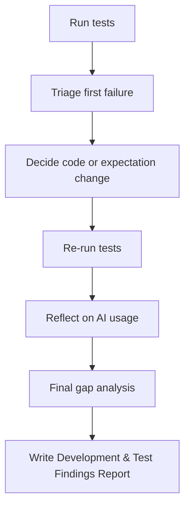

# Phase 4: Automated Tests and Development & Test Findings Report (15-25 mins)

## Goal of Phase 4
By the end of this phase you should have:
- Run your automated tests and captured the results (pass/fail)
- Triage any failures using a simple, repeatable approach
- Written a **Development & Test Findings Report** with an executive summary and key findings from testing
- Reflected on AI usage and what decisions you still had to make yourself
- Done a final gap analysis: what is still not fully proven

This is about **evidence**. You are proving your validator works, and you can explain it.

## Timebox (suggested)
- 0:00-0:10 Prepare and run tests
- 0:10-0:15 Fix or adjust (only if needed) and re-run tests
- 0:15-0:20 Reflect on AI usage + final gap analysis
- 0:20-0:25 Write Development & Test Findings Report

## Step-by-step guidance

### 1) Choose your test approach (0:00-0:05)
Use plain Python `assert`s (simple and reliable for this exercise).

For this exercise, it should:
- Cover at least 10 cases
- Include happy path, negative tests, and edge/risk cases
- Assert expected `decision` and expected `reason` codes

### AI Chat Mode Guidance: Generate Test Cases
Use chat mode to help create comprehensive test cases:
- "Help me write Python assert statements for testing the SafeSend validator with happy path, negative, and edge cases."
- "Generate test cases that cover all the reason codes: invalid_amount_low, invalid_sort_code, refer_high_value, etc."
- "Show me how to structure test_validator.py with multiple test functions using assert statements."

### 2) Final check before running (0:05-0:08)
Before you run:
1. Make sure your tests import the validator you wrote
   - example: your tests should call `validate_payment(...)`
2. Ensure your assertions are stable
   - reason codes are short stable strings
   - do not assert large free-text messages
3. Ensure reason-code ordering matches your design
   - for example: functional invalid reasons first, then risk reasons

If anything is unclear, fix it now rather than after the first failing run.

### 3) Run the tests (0:08-0:10)
Run your test script (example for the starter files):
- `python test_validator.py`

Record what happened:
- Did all tests pass?
- If not, which test failed first?

### 4) Triage failures with the “code vs expectation” rule (0:10-0:15)
When tests fail, do not guess. Use this approach:
1. Identify the first failing test
2. Ask:
   - Is the **requirement** wrong (your test expectations do not match the scenario)?
   - Or is the **code** wrong (your implementation does not match your own expectations)?
3. Only then decide:
   - If the scenario/requirements are clear: prefer changing the code
   - If you made an incorrect assumption in Phase 1: update your assumptions and adjust tests/implementation consistently
### AI Chat Mode Guidance: Debug Test Failures
Use chat mode to help analyze and fix test failures:
- "My test is failing with this assertion error. Help me understand if the code or test expectation is wrong."
- "The validator returns REFER but my test expects REJECT. Help me debug the decision logic."
- "How do I check if my reason codes are being added correctly in the test assertions?"
After changing anything:
- Re-run the tests
- Confirm the same failure is gone

### 5) Reflect on AI usage (0:15-0:18)
Write a short reflection:
- Where did AI help most (planning, coding, debugging, or test design)?
- Where did you still need to decide yourself?
- Did you validate AI output with your own reasoning and tests?

### 6) Final gap analysis (0:18-0:20)
Answer these questions:
1. Which rule IDs are still not fully proven by tests, and why?
2. If you had more time, what is the single most valuable extra test to add?

### 7) Write the Development & Test Findings Report (0:20-0:25)

> **Note**: In professional QE roles, test completion reports follow a formal structure defined by the team or organisation (e.g., IEEE 829, company templates) and can also have the bulk of the content generated by querying Jira, Xray Test, etc using JQL. The format here is simplified for this exercise.

Your report should be short but specific. Start with an executive summary, then the detail.

**Executive Summary** (2–3 sentences max):
Describe what was built, whether tests passed overall, and the single most important finding or risk identified.

**Findings detail** — include these sections:
1. What you tested (briefly describe happy path, negative, and edge/risk coverage)
2. What failed first (if anything)
3. What you changed (code changes, test expectation changes, or both)
4. Any remaining risks or gaps (what you still do not fully prove)
5. What you would do next in a real bank project
    - examples: more fraud rules, performance, logging, audit trail

Template you can copy:
```text
Development & Test Findings Report

Executive Summary:
<2-3 sentences: what was built, overall pass/fail status, key finding or risks or defects>

Findings:
- Coverage: happy path, negative tests, boundary tests, refer risk gates
- First failure: <test name or short description>
- Fix applied: <what changed and why>
- Remaining gaps: <rule ids not fully proven or missing edge cases>
- Next steps: <one or two improvements for a real release>
```

Mermaid diagram (optional): triage and re-run flow



## End-of-Phase 4 checklist
- [ ] I ran the automated tests and recorded results
- [ ] Any failures were triaged using a code vs expectation decision
- [ ] I re-ran tests after changes
- [ ] My Development & Test Findings Report contains an executive summary, what I tested, what failed, what I changed, and remaining gaps
- [ ] I included a short reflection on AI use
- [ ] I listed the single most valuable extra test I would add next

## AI Chat Mode Prompts (Organized by Testing Step)

### Test Case Generation
- "Help me write Python assert statements for testing the SafeSend validator with happy path, negative, and edge cases."
- "Generate test cases that cover all the reason codes: invalid_amount_low, invalid_sort_code, refer_high_value, etc."
- "Show me how to structure test_validator.py with multiple test functions using assert statements."

### Test Debugging
- "My test is failing with this assertion error. Help me understand if the code or test expectation is wrong."
- "The validator returns REFER but my test expects REJECT. Help me debug the decision logic."
- "How do I check if my reason codes are being added correctly in the test assertions?"

### Report Writing
- "Help me write an executive summary for my Development & Test Findings Report based on these test results."
- "Help me structure a findings report that covers what was tested, what failed, and what was changed."
- "Suggest what to include in the 'remaining gaps' section of my findings report."

