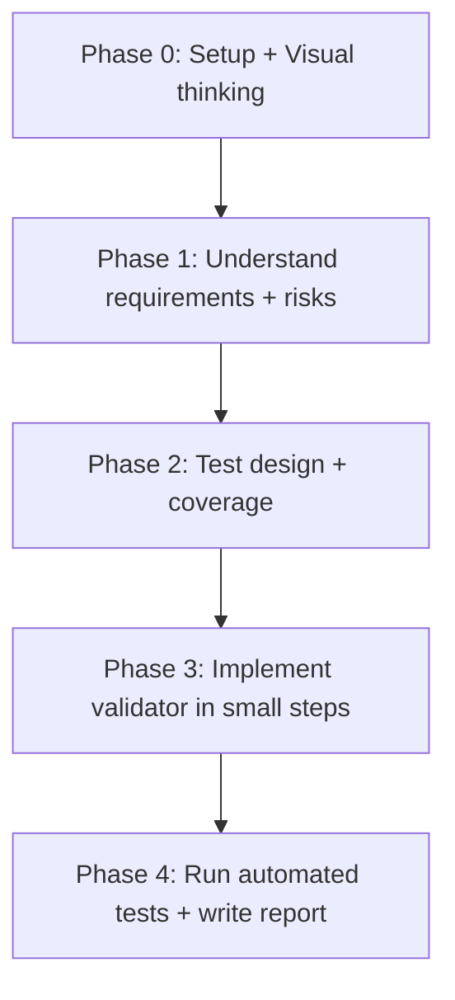

# SafeSend QE Exercise (Work Experience / Apprentices)

This project contains guidance and starter code for a UK retail bank exercise called **SafeSend**.
Your goal is to work in pairs (pair programming) to:
1) understand the rules and risks, 2) design tests, 3) implement the validator, and 4) run and report on automated tests.

## Pair Programming

This exercise is designed for pair programming. One person acts as the **driver** (writing code) while the other is the **navigator** (reviewing, suggesting, and catching errors). Switch roles regularly to ensure both participants learn.

## What you are building

A small validator that takes payment details and returns one of:
- `APPROVE` (valid and low risk)
- `REJECT` (invalid — must explain why)
- `REFER` (valid format but triggers risk gates — needs extra review)

You should return:
- `decision`: one of `APPROVE` / `REJECT` / `REFER`
- `reasons`: a list of stable reason codes (strings)

## Repository contents

- `safesend_qe_exercise_one_pager_and_guidance.md` — the full scenario and phases
- `phase0.md` to `phase4.md` — step-by-step guidance per phase
- `validator.py` — starter implementation of `validate_payment(payment)` (for students to work on)
- `test_validator.py` — starter automated tests (plain Python `assert`s)
- `validator_solved.py` — a complete working implementation (reference)
- `test_validator_solved.py` — a complete working test suite (reference)
- `validator_flow.md` — visual flowchart explaining the validator logic with code references

## Understanding the Code Logic

For a detailed visual explanation of how the validator works, see `validator_flow.md`. It contains a Mermaid flowchart with code line references and explanatory narrative to help students understand the process flow.

## Prerequisites

You need:
- Python installed (any modern Python 3 version is fine)
- VS Code (recommended)

## How to run the tests

Run from the project folder so imports work correctly.

1. Open PowerShell in VS Code or Terminal.
2. Run:

```powershell
cd "c:\Users\<USER>\projects\qe_work_experience"
python test_validator.py
```

If all tests pass, you should see:
- `All SafeSend validator tests passed.`

If a test fails, Python will raise an `AssertionError`. Use the failure message to decide whether:
- the code is wrong, or
- your expected outcome in the test is wrong

## What to change (typical workflow)

If tests fail:
1. Fix the smallest thing needed in `validator.py`
2. Re-run `python test_validator.py`
3. Once tests pass, update/add tests for any missing coverage

## Phases (quick map)



## Notes on AI usage

AI is a helper:
- it can suggest edge cases, code structure, or debugging steps
- you must still make the decisions and be able to explain your reasoning

Avoid pasting any real customer data into AI tools.

