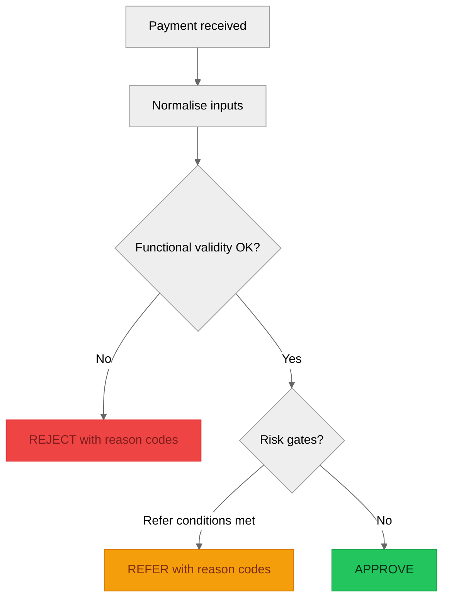
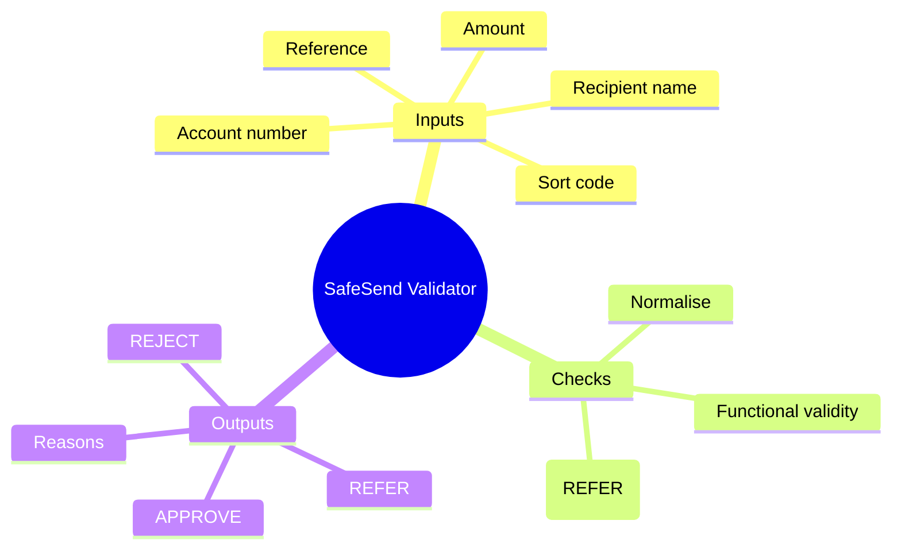

# Work Experience / Apprentice QE Exercise (UK Retail Bank)
## Scenario: “SafeSend” Payment Validator — Quality Engineering & Testing

## Exercise Timeline (At a Glance)

| Cumulative (mins) | Phase | Duration | Focus |
|-------------------|-------|----------|-------|
| ~10 | **Phase 0** — Setup & Orientation | 5–10 mins | Open VS Code, create files, draw mind-map and process flow |
| ~50 | **Phase 1** — Understand Requirements & Risks | 30–40 mins | Read rules, categorise checks, list assumptions, visualise decision logic |
| ~85 | **Phase 2** — Test Design | 25–35 mins | Write test plan (happy path, negative, edge/boundary cases), define reason codes |
| ~145 | **Phase 3** — Implement the Validator | 50–60 mins | Code in small steps: normalise inputs → functional checks → risk gates |
| ~170 | **Phase 4** — Automated Tests & Test Report | 15–25 mins | Run ≥10 tests, fix failures, write short test report |
| ~180 | **Phase 5** — Reflection Presentation | 5–10 mins | Create 3-slide reflection on QE skills learned and AI's role |
| | **Total** | **~3 hrs max** | |

> **Tip**: Don't rush to Phase 3. Strong requirements and test design (Phases 1–2) make implementation much smoother.

---

## 1) Student One‑Pager: Mission Brief

### Context
Our UK retail bank is launching a new in‑app feature called **SafeSend**. Before a customer payment is sent, the app must check it is **valid and safe**. These checks reduce mistakes, fraud risk, and customer harm.

### Our Mission (up to 3 hours)
Work like a **Quality Engineer**. We will: (1) understand the rules and risks, (2) define and visualise a solution, and (3) build and prove it with automated tests with help from AI in VS Code.

Critical thinking is the goal. Coding is only part of the job: we must be able to explain *why* each check exists and how our tests prove it.

### What we are building
A simple program that takes payment details and returns one of these outcomes:
- **APPROVE** (looks valid)
- **REJECT** (invalid — explain why)
- **REFER** (valid format, but needs extra review due to risk rules)

### Inputs (what the program receives)
- Amount (in £)
- Sort code (6 digits, e.g., `12-34-56` or `123456`)
- Account number (8 digits)
- Recipient name (text)
- Optional: Reference (text)

### Rules to implement (starter set)
**Functional validity rules:**
1. Amount must be at least **£0.01**
2. Amount must be no more than **£25,000**
3. Sort code must be **exactly 6 digits** (ignore spaces/hyphens)
4. Account number must be **exactly 8 digits**

**Risk / quality gates (result is REFER):**
5. If amount is **over £5,000** → REFER “High value payment”
6. If reference contains suspicious terms (e.g., “crypto”, “investment”, “urgent”) → REFER “Potential scam keywords”

### Success Criteria (what “done” looks like)
By the end we should have:
- A written **test plan** (what we will test and why)
- A working **validator** function/script
- A set of **automated tests** (at least 10 cases) covering good, bad, and edge cases
- A short **Development & Test Findings Report** with an executive summary, test results, and what we changed
### BDD (Behavior Driven Development) Approach
This exercise follows **Behavior Driven Development (BDD)** principles to ensure requirements are well-understood before implementation. You'll use **3-Amigos refinement** (now Power of 4 with AI) to define acceptance criteria, then translate them into test cases. While professional teams often use **Gherkin/Cucumber syntax** (Given/When/Then scenarios) for detailed behavior specifications, we'll keep it simple here with visuals and code for time efficiency.
### Tools & support
Use **VS Code** and AI assistance (chat/agent) to help write code, generate test data, and debug. We should still make the decisions: the AI is a helper, not the owner.

**AI Usage Guidance:**
- **Start with Chat/Ask Mode**: Begin with VS Code's chat interface for quick questions, code suggestions, and iterative development. Use it to brainstorm ideas, explain concepts, and get feedback on your thinking.
- **Progress to Agent Mode**: As tasks become more complex (like implementing full functions or debugging multiple issues), switch to agent mode for step-by-step assistance and code generation.
- **Human in the Loop**: Always review, understand, and explain AI suggestions. AI helps with implementation, but you must own the decisions, reasoning, and testing. Ask yourself: "Why does this make sense?" and "How does this align with the requirements?"

Before you ask AI to write code, try to:
- write your own solution steps in plain English
- sketch a process flow (or mind-map)
- list assumptions and open questions

### Stretch goals (if time)
- Add clearer error messages
- Add more edge cases (exactly £0.01, exactly £25,000, sort code with hyphens)
- Add a “blocked recipients” list and REFER when matched

---

## 2) Facilitator & Student Guidance Notes (Detailed)

### Phase 0 (5–10 mins): Setup & Orientation
- Open VS Code. Create a new folder for the exercise (e.g., `safesend_qe_exercise`).
- Create two files: `validator.py` and `test_validator.py`.
- Work in pairs (or simulate pairing if solo): take turns driving (writing code/tests) and navigating (reviewing, suggesting test ideas). Swap frequently.
- Key reminder: we are being assessed on **thinking and testing**, not typing speed.

Quick visual warm-up (hand-drawn is fine):
- Draw a *mind-map* of `SafeSend`: inputs -> validation -> risk gates -> outputs and reason codes
- Draw a *rough process flow* for how a payment moves from “received” to “APPROVE/REJECT/REFER”

### Phase 1 (30–40 mins): Understand Requirements & Risks
- Read the scenario and rules. Rewrite the rules in our own words.
- Separate rules into categories:
  - Functional validity (format/limits)
  - Risk-based gates (when to REFER)
- Clarify ambiguous parts by deciding assumptions (write them down). Example: “Sort code may include hyphens/spaces; we will strip them before checking digits.”

- Gap analysis step (before designing tests):
  - List what is *explicitly specified* vs what we must *infer/assume*
  - For each rule, decide: what would the user see (reason text/code) if it fails?
  - Identify edge cases that could break our assumptions (examples: exactly on a boundary, extra whitespace, multiple reasons)

- Visualise the decision logic:
  - Create a process flow diagram showing the order of checks (normalise -> functional checks -> risk checks -> decision)
  - Create a simple mapping from each rule to the outcome it can trigger (REJECT or REFER)

Optional mermaid templates (you can paste into a markdown preview, or just use them as structure):

- Create a simple “Requirements List” table with columns: **ID, Rule, Pass example, Fail example, Outcome (APPROVE/REJECT/REFER)**.
- Use AI help wisely: ask for examples of edge cases, but choose which ones matter in a bank context.
- **AI Tip**: In Chat mode, ask "What edge cases should I consider for UK bank sort codes?" to get suggestions, then decide which to include.

### Phase 2 (25–35 mins): Test Design (Test Plan + Test Cases)
- Solution design checkpoint (do this before coding):
  - Write the validator function signature (what goes in, what comes out)
  - Define the output schema (e.g., `decision` plus a list of `reasons`)
  - Decide check order and rationale (e.g., “reject basic format first; only then evaluate risk gates”)
  - List the reason codes you will assert in tests

- Create a Test Plan with 3 sections:
  - A) Happy path (valid payment)
  - B) Negative tests (invalid inputs)
  - C) Edge/boundary tests (values at the limits)
- For each rule, design at least 2 tests: one that should pass and one that should fail.
- Add boundary tests for amount:
  - £0.00 (reject)
  - £0.01 (approve)
  - £25,000 (approve)
  - £25,000.01 (reject)
- Add format tests:
  - Sort code with hyphens `12-34-56` should be treated as `123456`
  - Sort code with letters should reject
  - Account number 7 digits reject; 9 digits reject
- Risk tests:
  - £5,000.00 (approve) vs £5,000.01 (refer)
  - Reference includes “urgent” (refer)
- Define expected outputs precisely. Example: REJECT must include reason codes like `invalid_sort_code`.
- Optional: create a small test matrix or checklist to track coverage.

- Traceability / gap analysis (recommended):
  - Create a checklist that answers, for each rule ID:
    - Is there an implementation step for it? (Yes/No)
    - Is there at least one test that proves pass? (Yes/No)
    - Is there at least one test that proves fail? (Yes/No)
  - Any “No” becomes a specific task before we finish.

### Phase 3 (50–60 mins): Implement the Validator (Small Steps)
- Implement the solution in small steps:
  - Implement input normalisation first (e.g., strip hyphens/spaces from sort code)
  - Implement functional validity checks next (REJECT)
  - Implement risk gates last (REFER)

- Start from your design:
  - Implement a single function first, e.g. `validate_payment(payment) -> (decision, reasons)`.
- Represent a payment as a dictionary with keys: `amount`, `sort_code`, `account_number`, `recipient_name`, `reference`.
- Implement checks in a logical order: basic validity first (REJECT), then risk gates (REFER).
- Ensure we return **all reasons**, not just the first one (this is a QE-friendly design).
- Run the validator manually with 2–3 examples to confirm behaviour.
- Use AI prompts that describe intent, not code only. Example: “Write a Python function that strips non-digits from sort code and validates length is 6.”
- If something breaks, read the error carefully and ask AI to explain the error message in plain English, then fix.

- Micro gap checks while coding:
  - After each rule is implemented, add/confirm at least one test for it
  - If your tests reveal a mismatch with the scenario, update your assumptions (Phase 1) rather than quietly changing expectations

### Phase 4 (15–25 mins): Automated Tests & Test Report
- Use Python `assert`s in a test file.
- Create at least 10 tests covering: 3 happy path, 4 negative, 3 edge/risk.
- Run the tests. If any fail, decide: is the code wrong or is the test expectation wrong?
- Write a short Test Report (5–8 bullet points):
  - What we tested
  - What failed first
  - What we changed
  - Any remaining risks/gaps
  - What we would do next in a real bank project (e.g., more fraud rules, performance, logging, audit trail)
- Reflect on AI usage: where did it help, and what did we still need to decide ourselves?

- Final gap analysis question:
  - Which rule IDs are still not fully proven by tests, and why?
  - If we had more time, what is the single most valuable extra test to add?

### Helpful AI prompts (copy/paste)
- “Help us turn these rules into a test plan with happy/negative/edge cases.”
- “Generate 12 test payments as Python dictionaries with expected outcomes and reasons.”
- “Explain this Python error message in simple terms and suggest a fix.”
- “Review our validator logic for missing edge cases (UK sort code/account number).”
- “Suggest reason codes for each rejection to make test assertions stable.”

---

### Phase 5 (5–10 mins): Reflection Presentation
- Create a short Markdown reflection (3 slides) on QE/testing skills learned, with AI as support.
- Focus on:
  - What testing rules and decision logic you implemented (QE thinking)
  - What edge cases you found and how you handled them
  - How AI helped speed analysis and test generation, and where you needed human judgment
- Include:
  - One slide on “QE & testing skills developed”
  - One slide on “AI support for QE learning”
  - One slide on “Reflection: what worked, what was hard, and recommendations”
- End with a quick checklist of achieved outcomes:
  - [ ] QE/testing skills identified
  - [ ] AI support role documented
  - [ ] Reflections and improvements noted

### Marking / success checklist (quick)
- We documented assumptions and rules clearly.
- We visualised the solution (at least one process flow or mind-map) and can explain the check order.
- We produced test cases that cover boundaries and negative cases.
- We did a traceability/gap analysis and can point to rule IDs that are covered (and which are not).
- We implemented the validator in small steps and can explain it.
- We automated at least 10 tests and ran them successfully.
- We wrote a short test report and identified future improvements.
