# SafeSend Validator: Test Flow (Mermaid Diagram)

This diagram explains the test logic in `test_validator_solved.py` (and the student starter `test_validator.py`). It shows how the tests are organized by category and what specific assertions are made for each test case.

**Narrative summary:**
1. **Happy Path**: Test that valid payments return APPROVE with no reasons.
2. **Amount Boundaries**: Test low/high limits and REFER threshold (high value).
3. **Format Validation**: Test sort code normalization and account number length.
4. **Risk Gates**: Test high value and scam keyword detection.
5. **Edge Cases**: Test multiple reasons, blank references, and mixed invalid inputs.

> Note: Tests use `_base_payment()` helper to create test data with minimal overrides.

```mermaid
flowchart TD
  Start([Start Tests]) --> BaseHelper["_base_payment() helper<br/>Creates default valid payment"]

  BaseHelper --> HappyPath["Happy Path Test"]
  HappyPath --> HP_Assert["assert decision == APPROVE<br/>assert reasons == []"]

  BaseHelper --> AmountTests["Amount Boundary Tests"]
  AmountTests --> AmountLow["amount='0.00'"]
  AmountLow --> AL_Assert["assert decision == REJECT<br/>assert reasons == [INVALID_AMOUNT_LOW]"]

  AmountTests --> AmountMin["amount='0.01'"]
  AmountMin --> AM_Assert["assert decision == APPROVE<br/>assert reasons == []"]

  AmountTests --> AmountThreshold["amount='25000'"]
  AmountThreshold --> AT_Assert["assert decision == REFER<br/>assert reasons == [REFER_HIGH_VALUE]"]

  AmountTests --> AmountHigh["amount='25000.01'"]
  AmountHigh --> AH_Assert["assert decision == REJECT<br/>assert reasons == [INVALID_AMOUNT_HIGH]"]

  BaseHelper --> SortCodeTests["Sort Code Format Tests"]
  SortCodeTests --> SC_Hyphen["sort_code='12-34-56'"]
  SC_Hyphen --> SCH_Assert["assert decision == APPROVE<br/>assert reasons == []"]

  SortCodeTests --> SC_Space["sort_code='12 34 56'"]
  SC_Space --> SCS_Assert["assert decision == APPROVE<br/>assert reasons == []"]

  SortCodeTests --> SC_Short["sort_code='12345'"]
  SC_Short --> SCS_Assert2["assert decision == REJECT<br/>assert reasons == [INVALID_SORT_CODE]"]

  BaseHelper --> AccountTests["Account Number Tests"]
  AccountTests --> Acc_Short["account_number='1234567'"]
  Acc_Short --> AS_Assert["assert decision == REJECT<br/>assert reasons == [INVALID_ACCOUNT_NUMBER]"]

  AccountTests --> Acc_Long["account_number='123456789'"]
  Acc_Long --> AL_Assert2["assert decision == REJECT<br/>assert reasons == [INVALID_ACCOUNT_NUMBER]"]

  BaseHelper --> RiskTests["Risk Gate Tests"]
  RiskTests --> Risk_Threshold["amount='5000.00'"]
  Risk_Threshold --> RT_Assert["assert decision == APPROVE<br/>assert reasons == []"]

  RiskTests --> Risk_Over["amount='5000.01'"]
  Risk_Over --> RO_Assert["assert decision == REFER<br/>assert reasons == [REFER_HIGH_VALUE]"]

  RiskTests --> Risk_Keyword["reference='Urgent payment required'"]
  Risk_Keyword --> RK_Assert["assert decision == REFER<br/>assert reasons == [REFER_SCAM_KEYWORDS]"]

  RiskTests --> Risk_Multiple["amount='6000.00'<br/>reference='crypto transfer'"]
  Risk_Multiple --> RM_Assert["assert decision == REFER<br/>assert reasons == [REFER_HIGH_VALUE, REFER_SCAM_KEYWORDS]"]

  BaseHelper --> EdgeTests["Edge Case Tests"]
  EdgeTests --> Edge_Mixed["amount='0.00'<br/>sort_code='12345'"]
  Edge_Mixed --> EM_Assert["assert decision == REJECT<br/>assert reasons == [INVALID_AMOUNT_LOW, INVALID_SORT_CODE]"]

  EdgeTests --> Edge_BlankRef["reference=''"]
  Edge_BlankRef --> EB_Assert["assert decision == APPROVE<br/>assert reasons == []"]

  HP_Assert --> TestComplete
  AL_Assert --> TestComplete
  AM_Assert --> TestComplete
  AT_Assert --> TestComplete
  AH_Assert --> TestComplete
  SCH_Assert --> TestComplete
  SCS_Assert --> TestComplete
  SCS_Assert2 --> TestComplete
  AS_Assert --> TestComplete
  AL_Assert2 --> TestComplete
  RT_Assert --> TestComplete
  RO_Assert --> TestComplete
  RK_Assert --> TestComplete
  RM_Assert --> TestComplete
  EM_Assert --> TestComplete
  EB_Assert --> TestComplete
  TestComplete(["All tests passed!"])
```

## Test Categories Explained

### Happy Path Tests
- **Purpose**: Verify that valid payments work correctly
- **Coverage**: Standard valid payment with all required fields
- **Assertions**: `decision == APPROVE`, `reasons == []`

### Amount Boundary Tests
- **Purpose**: Test amount validation limits and REFER threshold
- **Coverage**: Minimum (£0.01), maximum (£25,000), and high-value REFER (£5,000+)
- **Edge Cases**: Exactly at boundaries, just over limits

### Format Validation Tests
- **Purpose**: Test input normalization and format requirements
- **Coverage**: Sort code (6 digits, handles hyphens/spaces), account number (8 digits)
- **Edge Cases**: Wrong lengths, different separators

### Risk Gate Tests
- **Purpose**: Test REFER conditions for high-value and suspicious payments
- **Coverage**: Amount threshold (£5,000), scam keywords (case-insensitive)
- **Edge Cases**: Multiple risk triggers, threshold boundaries

### Edge Case Tests
- **Purpose**: Test complex scenarios and error handling
- **Coverage**: Multiple validation failures, blank references
- **Assertions**: Correct decision priority, all applicable reasons returned

## Test Structure Notes

- **Helper Function**: `_base_payment(**overrides)` creates consistent test data
- **Assertion Pattern**: Always check both `decision` and `reasons` list
- **Reason Ordering**: Functional validity reasons appear before risk reasons
- **Decision Priority**: REJECT takes precedence over REFER when both apply

## Code References

- **Line 23-32**: `_base_payment()` helper function
- **Line 35-38**: Happy path test
- **Line 40-55**: Amount boundary tests
- **Line 57-67**: Sort code format tests
- **Line 69-77**: Account number tests
- **Line 79-95**: Risk gate tests
- **Line 97-105**: Edge case tests</content>
