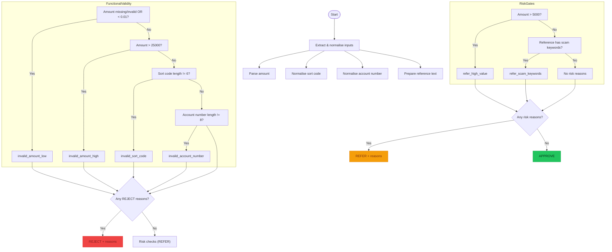

# SafeSend Validator: Code Flow (Mermaid Diagram)

This diagram explains the detailed logic in `validator_solved.py` (and the student starter `validator.py`). It shows how inputs are parsed, validated, and how the decision (`APPROVE` / `REJECT` / `REFER`) is produced.

**Narrative summary:**
1. Normalize inputs (strip punctuation, parse numbers).
2. Reject immediately if any required field is invalid (REJECT + reason codes).
3. If valid, check risk gates (high value and scam keywords) to decide REFER.
4. Otherwise, return APPROVE.

> Note: Reason codes are stable strings used by the tests.

## Key helper functions

- `_normalise_digits(value)`
  - Removes anything that isn't `0-9` (e.g., `"12-34-56"` → `"123456"`).

- `_parse_amount_pounds(value)`
  - Converts input to `Decimal` and returns `None` for invalid values.

## Suspicious keywords (risk triggers)

The validator considers the `reference` unsafe if it contains any of:
- `crypto`
- `investment`
- `urgent`

These are checked case-insensitively (e.g., `"Crypto"` matches).
